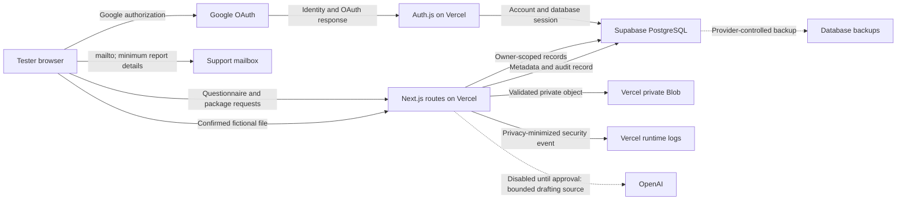

# Data inventory and flow map

Status: Application inventory completed July 22, 2026. Provider configuration evidence remains required before the real-data gate can close.

This inventory describes the code currently deployed for the fictional-data Alpha. It is not approval to process real medical or claimant information. Relationships listed below are Prisma navigation helpers; they do not create additional columns beyond their foreign keys.

## Classification key

- **Restricted claim data:** questionnaire answers, narratives, timelines, condition labels, evidence notes, document contents, OCR text, or any future real health information.
- **Authentication secret:** session, OAuth, verification, or password material that must never be exported or logged.
- **Personal identifier:** name, email, provider account ID, or profile image.
- **Security metadata:** pseudonymous counters, checksums, audit events, deletion tasks, timestamps, and safe error codes.
- **Public reference:** product-authored condition, evidence, template, question, and form content.

## PostgreSQL field inventory

| Model and field | Classification and purpose | Export and deletion behavior |
| --- | --- | --- |
| `User.id` | Internal account identifier | Exported; cascade root for account deletion |
| `User.name` | Personal identifier from Google or account profile | Exported; deleted with account |
| `User.email` | Personal identifier and login contact | Exported; deleted with account |
| `User.emailVerified` | Authentication metadata | Exported; deleted with account |
| `User.image` | Personal identifier/profile URL | Exported; deleted with account |
| `User.passwordHash` | Authentication secret; retained for legacy schema compatibility and not used by Google-only login | Never exported; deleted with account |
| `User.createdAt`, `User.updatedAt` | Account lifecycle metadata | Exported; deleted with account |
| `User.accounts`, `User.sessions`, `User.claims`, `User.uploads`, `User.documents`, `User.auditEvents`, `User.statements` | Prisma relationship helpers | Underlying related rows follow the rules below |
| `Document.id` | Internal document identifier | Exported; deleted with document/workspace/account |
| `Document.userId`, `Document.claimId` | Ownership and workspace authorization keys | Exported; cascaded with owner/workspace |
| `Document.originalName` | Restricted user-supplied filename after normalization | Exported; never included in security logs; deleted with record |
| `Document.storageKey` | Authentication-adjacent private object locator | Never exported or sent to the browser; deleted after verified object deletion |
| `Document.mimeType`, `Document.size` | File-validation and delivery metadata | Exported; permitted in account audit metadata |
| `Document.sha256` | Security metadata for integrity/duplicate review | Exported; deleted with record |
| `Document.provider` | Storage-routing metadata | Exported; deleted with record |
| `Document.status` | Test/quarantine/readiness state | Exported; deleted with record |
| `Document.syntheticConfirmed` | Fictional-data acknowledgement | Exported; deleted with record |
| `Document.createdAt`, `Document.updatedAt` | Lifecycle metadata | Exported; deleted with record |
| `Document.user`, `Document.claim`, `Document.pages`, `Document.auditEvents` | Prisma relationship helpers | No separate stored value |
| `DocumentPage.id`, `DocumentPage.documentId`, `DocumentPage.pageNumber` | Page identity and ordering | Exported; cascaded with document |
| `DocumentPage.ocrText` | Restricted extracted document content; future capability, currently not populated | Exported if present; deleted with document |
| `DocumentPage.createdAt`, `DocumentPage.updatedAt` | Lifecycle metadata | Exported; deleted with document |
| `DocumentPage.document` | Prisma relationship helper | No separate stored value |
| `AuditEvent.id` | Internal audit identifier | Exported to the account owner; deleted with account |
| `AuditEvent.actorUserId`, `AuditEvent.claimId`, `AuditEvent.documentId` | Ownership and subject references | Exported; account deletion cascades or nulls subject links |
| `AuditEvent.action` | Fixed application audit action | Exported; deleted with account |
| `AuditEvent.metadata` | Restricted to MIME type, byte size, provider name, and fictional-test flag | Exported; must not contain filenames, contents, tokens, or storage keys |
| `AuditEvent.createdAt` | Audit timestamp | Exported; deleted with account |
| `AuditEvent.actor`, `AuditEvent.claim`, `AuditEvent.document` | Prisma relationship helpers | No separate stored value |
| `Account.id`, `Account.userId` | Authentication record identity/ownership | Account type and provider metadata exported; deleted with account |
| `Account.type`, `Account.provider`, `Account.providerAccountId` | Authentication and personal identifier metadata | Exported; deleted with account |
| `Account.refresh_token`, `Account.access_token`, `Account.id_token` | OAuth secrets supplied by the provider | Never exported or logged; deleted with account |
| `Account.expires_at`, `Account.token_type`, `Account.scope`, `Account.session_state` | OAuth security metadata | Non-secret connection metadata is exported; deleted with account |
| `Account.user` | Prisma relationship helper | No separate stored value |
| `Session.id`, `Session.userId`, `Session.expires` | Database-session identity, ownership, and expiry | Only expiry is exported; deleted with account or sign-out lifecycle |
| `Session.sessionToken` | Authentication secret stored in the database and an essential cookie | Never exported or logged; deleted with session/account |
| `Session.user` | Prisma relationship helper | No separate stored value |
| `VerificationToken.identifier`, `VerificationToken.token`, `VerificationToken.expires` | Authentication secret and lifecycle fields; unused by current Google-only login | Never exported; expires or is deleted by Auth.js lifecycle |
| `RateLimitBucket.id` | Internal counter identifier | Not exported |
| `RateLimitBucket.scope`, `RateLimitBucket.windowStart`, `RateLimitBucket.windowEndsAt`, `RateLimitBucket.count` | Security metadata for fixed-window limits | Exported to owner without a principal; automatically expires after the cleanup window |
| `RateLimitBucket.principalHash` | HMAC-pseudonymous account or global principal | Never exported or logged; deleted with account counters |
| `RateLimitBucket.createdAt`, `RateLimitBucket.updatedAt` | Counter lifecycle metadata | Not exported; deleted with counter |
| `StorageReconciliationTask.id`, `StorageReconciliationTask.fingerprint`, `StorageReconciliationTask.principalHash` | Internal and HMAC-pseudonymous cleanup identity | IDs/hashes are not exported; deleted after resolution/account deletion |
| `StorageReconciliationTask.operation`, `StorageReconciliationTask.scope`, `StorageReconciliationTask.status`, `StorageReconciliationTask.attempts`, `StorageReconciliationTask.lastErrorCode` | Privacy-minimized cleanup state | Exported to owner; safe fields may be logged |
| `StorageReconciliationTask.entityId` | Internal cleanup subject | Exported to owner; never logged |
| `StorageReconciliationTask.storageKey` | Private object locator required for retry | Never exported or logged; removed with task |
| `StorageReconciliationTask.lastAttemptAt`, `StorageReconciliationTask.resolvedAt`, `StorageReconciliationTask.createdAt`, `StorageReconciliationTask.updatedAt` | Cleanup lifecycle metadata | Exported to owner; removed with task |
| `Claim.id`, `Claim.userId` | Workspace identity and authorization key | Exported; deleted with workspace/account |
| `Claim.title`, `Claim.branch`, `Claim.mosRate`, `Claim.symptomStart`, `Claim.deploymentHistory`, `Claim.exposures`, `Claim.treatment` | Restricted claim and service information | Exported; deleted with workspace/account |
| `Claim.status`, `Claim.progress`, `Claim.draftVersion` | Workflow and concurrency state | Exported; deleted with workspace/account |
| `Claim.draftData` | Restricted questionnaire, timeline, statement, evidence-link, buddy-statement, and package state | Exported; deleted with workspace/account |
| `Claim.createdAt`, `Claim.updatedAt` | Workspace lifecycle metadata | Exported; deleted with workspace/account |
| `Claim.user`, `Claim.conditions`, `Claim.evidence`, `Claim.answers`, `Claim.progressItems`, `Claim.statements`, `Claim.documents`, `Claim.auditEvents` | Prisma relationship helpers | Underlying rows follow their own rules |
| `Condition.id`, `Condition.slug`, `Condition.name`, `Condition.overview`, `Condition.ratingCriteria`, `Condition.typicalEvidence`, `Condition.requiredDiagnosis`, `Condition.commonMistakes`, `Condition.helpfulDocumentation`, `Condition.relatedConditions`, `Condition.createdAt`, `Condition.updatedAt` | Public reference content maintained by Debrief | Not user export data; retained as product content |
| `Condition.claims` | Prisma relationship helper | No separate stored value |
| `ClaimCondition.claimId`, `ClaimCondition.conditionId` | Restricted association between a workspace and reference condition | Exported through the claim; deleted with claim |
| `ClaimCondition.claim`, `ClaimCondition.condition` | Prisma relationship helpers | No separate stored value |
| `EvidenceType.id`, `EvidenceType.slug`, `EvidenceType.name`, `EvidenceType.category`, `EvidenceType.description`, `EvidenceType.purpose`, `EvidenceType.strength`, `EvidenceType.whenToUse`, `EvidenceType.commonMistakes`, `EvidenceType.examples` | Public reference content maintained by Debrief | Not user export data; retained as product content |
| `EvidenceType.evidence` | Prisma relationship helper | No separate stored value |
| `Evidence.id`, `Evidence.claimId`, `Evidence.evidenceTypeId` | Evidence record identity and associations | Exported; deleted with claim |
| `Evidence.title`, `Evidence.notes`, `Evidence.status` | Restricted evidence description and workflow state | Exported; deleted with claim |
| `Evidence.createdAt`, `Evidence.updatedAt` | Lifecycle metadata | Exported; deleted with claim |
| `Evidence.claim`, `Evidence.type`, `Evidence.uploads` | Prisma relationship helpers | No separate stored value |
| `Upload.id`, `Upload.userId`, `Upload.evidenceId` | Legacy upload identity, ownership, and evidence association | Metadata exported; deleted with account/evidence rules |
| `Upload.filename` | Restricted legacy filename | Exported; never logged |
| `Upload.storageKey` | Private legacy object locator | Never exported or logged; included in verified account cleanup |
| `Upload.mimeType`, `Upload.size`, `Upload.provider`, `Upload.createdAt` | Legacy file and lifecycle metadata | Exported; deleted with account |
| `Upload.user`, `Upload.evidence` | Prisma relationship helpers | No separate stored value |
| `Template.id`, `Template.slug`, `Template.name`, `Template.category`, `Template.purpose`, `Template.instructions`, `Template.body`, `Template.createdAt`, `Template.updatedAt` | Public reference/template content | Retained as product content |
| `Template.statements` | Prisma relationship helper | No separate stored value |
| `Statement.id`, `Statement.userId`, `Statement.claimId`, `Statement.templateId` | Statement identity, ownership, and associations | Exported; deleted with account; claim/template links may be nulled |
| `Statement.title`, `Statement.content` | Restricted user statement content | Exported; deleted with account |
| `Statement.createdAt`, `Statement.updatedAt` | Lifecycle metadata | Exported; deleted with account |
| `Statement.user`, `Statement.claim`, `Statement.template` | Prisma relationship helpers | No separate stored value |
| `VAForm.id`, `VAForm.slug`, `VAForm.formNumber`, `VAForm.name`, `VAForm.purpose`, `VAForm.description`, `VAForm.whenToUse`, `VAForm.completedBy`, `VAForm.typicalMistakes`, `VAForm.status`, `VAForm.createdAt`, `VAForm.updatedAt` | Public form-reference content | Retained as product content |
| `Question.id`, `Question.key`, `Question.prompt`, `Question.helpText`, `Question.kind`, `Question.order`, `Question.createdAt` | Public questionnaire definition | Retained as product content |
| `Question.answers` | Prisma relationship helper | No separate stored value |
| `Answer.id`, `Answer.claimId`, `Answer.questionId` | Answer identity and associations | Exported; deleted with claim |
| `Answer.value` | Restricted questionnaire answer | Exported; deleted with claim |
| `Answer.createdAt`, `Answer.updatedAt` | Lifecycle metadata | Exported; deleted with claim |
| `Answer.claim`, `Answer.question` | Prisma relationship helpers | No separate stored value |
| `Progress.id`, `Progress.claimId`, `Progress.key`, `Progress.label`, `Progress.complete`, `Progress.updatedAt` | Workflow state and association | Exported; deleted with claim |
| `Progress.claim` | Prisma relationship helper | No separate stored value |

## Browser and transient data

| Location | Data | Control and deletion |
| --- | --- | --- |
| `localStorage` key `vcc-claim-draft` | Signed-out `StoredDraft`: questionnaire answers, statement, provenance, timeline, evidence map, confirmations, document-link identifiers, revision history, package state, and buddy statements | Same-origin JavaScript can read it; removed when transferred/cleared or by account deletion's `Clear-Site-Data`. It must remain fictional-only and is not acceptable for real health data without a new design. |
| `localStorage` key `vcc-claim-workspaces` | Up to 10 archived signed-out drafts with the same restricted fields | Same controls and unresolved real-data restriction as the active draft |
| Essential Auth.js cookie | Opaque database session token and OAuth transaction cookies | Secure/HTTP-only behavior is managed by Auth.js in hosted HTTPS; revoked by session/account lifecycle and `Clear-Site-Data` |
| React component state | Unsaved answers, selected fictional files, generated drafts, and UI state | Exists in memory until navigation/refresh; a chosen file is transmitted only after confirmation |
| Generated browser Blob URLs | Personal/buddy statement text, package PDF, export JSON, or deletion receipt | Created only for download and revoked after use; the user controls downloaded copies |

## Service and provider inventory

| System | Receives or stores | Current boundary | Evidence still required |
| --- | --- | --- | --- |
| Browser/device | Page content, cookies, local drafts, downloads, selected files | Fictional data only; device owner controls local copies | Real-data browser-storage decision and device guidance |
| Vercel application runtime | Requests, server-rendered pages, API bodies in memory, environment variables, privacy-minimized runtime events | Request bodies are not intentionally logged; API responses use no-store where private | Runtime/build log retention, staff access, region, drain/access configuration |
| Supabase PostgreSQL | All Prisma models above via a server-only direct connection | RLS enabled and public Data API grants revoked; no browser Supabase client | Project region, SSL enforcement evidence, encryption/key ownership, administrator access, backups, contracts, restoration test |
| Vercel private Blob | Fictional PDF/JPEG/PNG object bytes under random private keys | Server-only credentials; short-lived owner-bound application tickets; private delivery | Region, encryption/key ownership, administrator access, object/version retention and contractual evidence |
| Google OAuth | Authorization request, account identity, consent, and transient authorization codes | Separate clients by environment; application stores identity and provider tokens in PostgreSQL | Approved scopes, retention, administrator/MFA evidence, OAuth Production review |
| Vercel/GitHub build systems | Source, dependency metadata, release commit, non-secret build output | Persistent credentials are excluded from Preview; repository has protected release branches | Administrator/access review and provider retention evidence |
| Support email provider | Reporter address and the minimum details a reporter chooses to send from `/support` | Page instructs reporters not to include claims, health data, credentials, or private screenshots | Named monitored mailbox, access list, retention, secure deletion, and incident escalation evidence |
| OpenAI Responses API (future/disabled) | Questionnaire and timeline source except optional display name, only after sign-in and in-product acknowledgement | `store:false`, bounded request/output, explicit kill switch; no key is expected during the free Alpha | Provider/legal/retention/region/subprocessor approval and AI safety gate |

## Data-flow map

## Route and trust-boundary summary

- Public pages serve product content and carry no account data.
- `/api/auth/[...nextauth]` crosses the Google/Auth.js/PostgreSQL boundary.
- `/api/claims`, `/api/workspaces`, `/api/documents`, and `/api/account` require a database session and reapply `session.user.id` to owner-scoped queries.
- Mutation routes enforce same-origin checks and durable rate limits.
- `/api/documents/[id]/download-link` issues a 60-second owner/document-bound ticket; `/content` rechecks the session, ticket, and owner before reading Blob.
- `/api/claim-package` accepts a size-bounded fictional draft and creates a PDF in memory; it does not persist the PDF.
- `/api/ai/personal-statement` uses the deterministic local template unless the AI gate, authentication, key, and limits are all active.

## Required review and change control

Update this document and its inventory regression whenever the Prisma schema, browser storage keys, external providers, support channel, logging contract, authentication flow, document pipeline, or AI flow changes. Provider evidence must be recorded without copying secret values. Qualified legal and independent security review are still required before real-data processing.

## Provider references

- [Supabase data security](https://supabase.com/docs/guides/database/secure-data)
- [Supabase database backups](https://supabase.com/docs/guides/platform/backups)
- [Vercel runtime logs](https://vercel.com/docs/logs)
